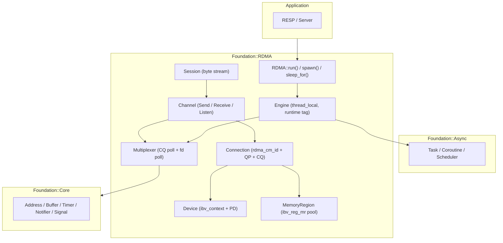
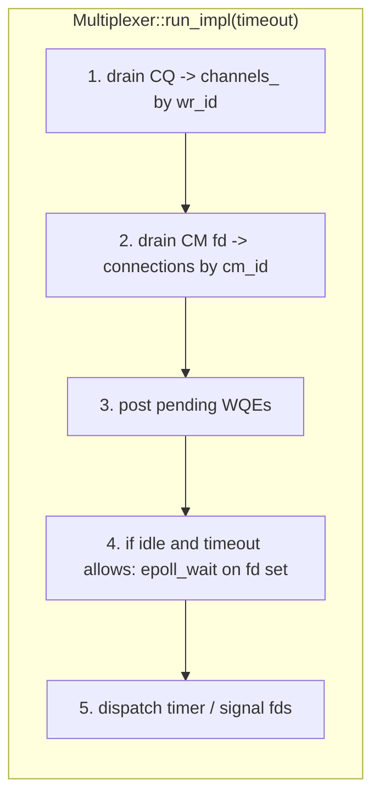
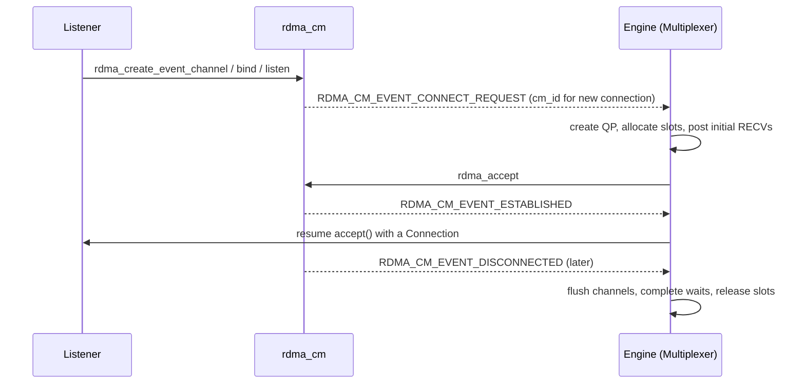
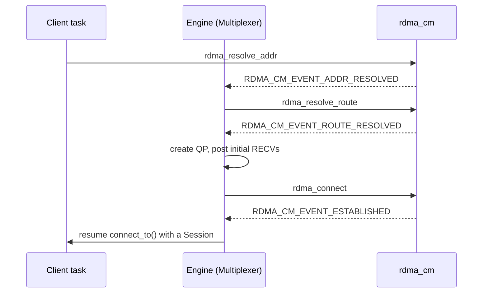

# RDMA Backend

## Overview

The RDMA backend is a second, self-contained asynchronous runtime in
`Foundation`, living in `Foundation/RDMA`. It is an alternative to the
`Foundation::NBIO` runtime and is expected to be used the same way:

```cpp
Foundation::RDMA::run(serve(address));
```

`NBIO` and `RDMA` are **two independent systems**. They deliberately share the
generic coroutine machinery in `Foundation::Async` and the resources in
`Foundation::Core`, mirroring each other's *shape* where that shape is genuinely
the same. They do **not** share channels, sessions, or a common backend base
class: nothing in `NBIO` knows that `RDMA` exists, and nothing in `RDMA` includes
`NBIO`. Duplication of a few small, stable types is accepted in exchange for two
systems that can evolve without dragging each other along.

Sharing a *shape* is not sharing a *skeleton*. `RDMA`'s multiplexer is a concrete
class because RDMA has a single backend, whereas `NBIO`'s is an abstract base
because it selects between `epoll` and `io_uring` at startup. The two look alike
at the call sites and are otherwise unrelated.

This document describes the intended design. It is written before the
implementation, so it doubles as a plan of record and is expected to be updated
as decisions land.

## Goals

- A runtime that a `Foundation::Async` task can run on, reached through
  `Foundation::RDMA::run()` and `Foundation::RDMA::spawn()`.
- Reliable, connection-oriented, ordered data transfer — "TCP-like" semantics —
  for the first version.
- A server path (`listen_on` → `accept` → `Session`) that mirrors the `NBIO`
  server path closely enough that the RESP layer can be reused without changes
  to its logic.
- Memory-safety and lifetime guarantees at least as strong as `NBIO`: a channel
  must never be resumed after its waiting coroutine is gone.

## Non-Goals (for the first version)

- One-sided operations (`RDMA READ` / `RDMA WRITE`) and atomic verbs.
- Zero-copy receive into application-owned memory.
- Native InfiniBand addressing (LID/GID routing); the first version targets
  RoCEv2 so that the existing `Foundation::Core::Address` (IPv4) can be reused.
- Automatic reconnection / failover.
- Multi-threaded engines. Like `NBIO`, one engine per thread, installed as a
  `thread_local`.

## Transport Model

The transport is **RC (Reliable Connected) queue pairs**, established over
`librdmacm`. RC gives us, at the hardware level, exactly the properties the
first version needs:

| Property | Provided by |
|---|---|
| Connection-oriented | `rdma_cm` connect/accept |
| Reliable, in-order delivery | RC transport |
| Two-sided messaging (`SEND`/`RECV`) | `ibv_post_send` / `ibv_post_recv` |
| Flow control | RC link-layer credits |
| Teardown notification | `RDMA_CM_EVENT_DISCONNECTED` |

Because RC `SEND`/`RECV` is message-oriented while RESP is a byte stream, the
`Session` exposes a **byte-stream** interface identical in signature to
`NBIO::Session::receive`/`send`. RESP is self-delimiting, so as long as bytes
arrive in order (guaranteed by RC) the framing works unchanged. Message
boundaries are an implementation detail the `Session` hides.

### What "reliable (TCP)" means here, concretely

1. **Ordered, reliable bytes.** Guaranteed by RC; nothing to implement.
2. **Connection setup/teardown.** Implemented with `rdma_cm` (see the lifecycle
   section).
3. **Receive flow control.** RC protects the *wire*, not the *receiver*. A peer
   can send faster than we re-post receive buffers, so the session keeps a pool
   of posted receive slots and applies backpressure when it runs dry.
4. **Graceful close.** A disconnect surfaces to every outstanding operation as a
   conclusive status, never as a hang.
5. **Error surfacing.** Completion errors are mapped into the same
   `Foundation::Core::ReceiveResult` / `SendResult` shapes `NBIO` uses, so the
   RESP layer is unchanged.

### No sockets; three layers of identity

**The RDMA backend never creates a socket.** `Foundation::Core::Socket` is not
used at all — there is no `socket()`/`bind()`/`accept()` anywhere under
`Foundation/RDMA`. Two things take its place:

- `Core::Address` is still reused, because `rdma_cm` still speaks in `sockaddr`
  terms: `rdma_bind_addr(id, addr)` and `rdma_resolve_addr(id, ...)` both take a
  `struct sockaddr *`. An endpoint is still named by IP and port; the kernel
  owns the transport beneath it.
- The CM "channel" is an **fd, not a socket**. The header says so directly:

  ```c
  struct rdma_event_channel { int fd; };
  ```

  `rdma_create_event_channel()` returns that fd, and it is pollable — which is
  what lets the fd half of the composite multiplexer watch connection events
  alongside the timer and signals.

Beneath `rdma_cm` the wire is the NIC's business: RoCEv2 is encapsulated in
UDP/IP and iWARP in TCP, and the connection-management handshake the kernel
performs beneath `rdma_bind_addr` / `rdma_listen` is invisible to us.

Because the vocabulary is socket-shaped but the objects are not, it is worth
naming the **three distinct layers of identity**:

| Layer | Identity | Who reads it |
|---|---|---|
| Connection management | `rdma_cm_id *` | `rdma_cm` events (`RDMA_CM_EVENT_*`) |
| Hardware transport | `ibv_qp *`, whose `qp_num` is the QPN | posting WQEs; `ibv_wc.qp_num` on completion |
| Our routing | `Channel::Handle` (the verbs `wr_id`) | the multiplexer, to route a completion back to a channel |

The channel's identifier therefore sits **on top of** the underlying object, as
you describe. `rdma_cm_id` is the connection-management object and already owns
the transport objects — `struct rdma_cm_id` holds `verbs`, `channel`, `qp`,
`send_cq`, `recv_cq` and `pd` — so `Connection` is a thin owner around a single
`rdma_cm_id *`, and `Connection::qp()` is simply `id->qp`.

The initial implementation chooses one completion queue and completion channel
per `RDMA_Channel`. This makes the channel's pollable handle local and obvious:
`RDMA_Channel::native_handle()` returns `ibv_comp_channel::fd`, while its
`poll()` drains its own CQ. A later shared-CQ optimization can route by
`(qp_num, wr_id)` or a globally unique `wr_id`, but it is not required by the
first design.

## Architecture



The engine is the runtime tag that `Foundation::Async` tasks are parameterized
on, exactly as `NBIO::Engine` is. `Foundation::Async` never sees RDMA specifics;
it asks the tag for a scheduler.

## Components

### `Engine` — the runtime tag

One engine per thread, installed as a `thread_local`. It owns everything the
backend needs and hands it out through static accessors.

```cpp
namespace Foundation::RDMA
{
class Engine
{
  public:
    static void initialize(Configuration configuration);
    static bool is_initialized();
    static Engine &instance();

    // What Foundation::Async asks of a runtime tag.
    static Foundation::Async::Scheduler &scheduler();
    static Multiplexer &multiplexer();

    static NotifyChannel &notify_channel();
    static TimerChannel &timer_channel();
    static SignalChannel &signal_channel();

  private:
    static thread_local std::unique_ptr<Engine> engine_;
};
} // namespace Foundation::RDMA
```

Member order matters for the same reason it does in `NBIO::Engine`: the
multiplexer is declared first so the scheduler's idle hook can capture it, and
the channels come last so they are destroyed first (a channel unregisters itself
through `multiplexer_.delete_channel()` in its destructor, which needs a live
multiplexer).

`Configuration` selects the device and tunes the buffers:

```cpp
struct Configuration
{
    std::string device;             // ibv device name; empty selects the first active port
    std::uint8_t port{1};           // IB port number
    std::uint8_t gid_index{0};      // RoCEv2 GID index
    std::size_t receive_slots{256}; // posted receive buffers per connection
    std::size_t slot_size{4096};    // size of one receive slot
    bool busy_poll{false};          // false (default): sleep on the completion
                                    // channel when idle. true: spin on the CQ.
};
```

### `Multiplexer` — the completion poller

`RDMA` channels are completion-driven, not readiness-driven: an operation is
*posted*, and a *completion* carries its outcome. That is the same model
`URingMultiplexer` uses.

Unlike `NBIO::Multiplexer`, this is a **concrete class with no base class and no
virtual functions**. `NBIO` needs a polymorphic `Multiplexer` because it chooses
between `epoll` and `io_uring` at startup and `Engine` holds a
`std::unique_ptr<Multiplexer>`; `RDMA` has exactly one backend, so there is
nothing to choose and nothing to make virtual. It shares the *shape* — the same
entry points, driven the same way by `Engine`'s idle hook — not a skeleton.

```cpp
class Multiplexer   // concrete; no virtual functions
{
  public:
    void add_channel(Channel *channel);     // registers and assigns the channel's handle
    void update_channel(Channel *channel);  // armed -> post, disarmed -> withdraw
    void delete_channel(Channel *channel) noexcept;
    void run();
    void run_for(std::chrono::milliseconds timeout);

    ibv_cq *completion_queue() noexcept;

  private:
    void run_impl(int timeout_ms);
    void drain_completions();               // ibv_poll_cq, then route by wr_id
    void post_pending();

    // 1:1, unlike NBIO's fd-keyed multimap. See "Handles" under Channel.
    std::unordered_map<Channel::Handle, Channel *> channels_;
    Channel::Handle next_handle_{1};        // handed out by add_channel()
    std::vector<Channel *> pending_submissions_;
    ibv_cq *completion_queue_{nullptr};
    int epoll_handle_{-1};                  // CM events, timerfd, signalfd
};
```

Unlike `NBIO`, this multiplexer is a **composite**: it drives two sources, and
there is no single kernel object that delivers both.

1. **The completion queue — the data plane** (the primary source).
   `ibv_poll_cq()` drains `ibv_wc` entries. Each completion carries a `wr_id`
   identifying the channel that posted it, plus a status. This is what wakes
   send and receive channels.
2. **A file descriptor set — connection setup plus housekeeping.** The `rdma_cm`
   event channel (`struct rdma_event_channel { int fd; }`) is the source of
   connection lifecycle events, and it shares an `epoll` instance with the timer
   fd and the signal fd. Optionally the CQ's completion channel
   (`ibv_create_comp_channel`, also an fd) joins them for a non-spinning idle
   path.

So `rdma_event_channel` is **not** the multiplexer's underlying object — it is
one fd in the half of the loop that handles connection setup. Data completions
never come from it.



### Two routing domains

Control and data events are keyed differently, so the multiplexer (or a small
connection manager it drives) keeps **two registries**, not one:

| Source | Key carried by the event | Resolves to |
|---|---|---|
| Completion queue (`ibv_wc`) | `wr_id` (our `Channel::Handle`) | the `SendChannel` / `ReceiveChannel` that posted |
| `rdma_event_channel` (`rdma_cm_event`) | `event->id`, an `rdma_cm_id *` | the `Listener` or the in-progress `Connection` |

A CM event describes a *connection's* state (`CONNECT_REQUEST`, `ESTABLISHED`,
`DISCONNECTED`); a completion describes a *channel's* operation. Conflating them
would lose the ability to tell a receive completion apart from a disconnect.

There is exactly **one CM event channel per engine**, shared by every
`rdma_cm_id`: `rdma_create_id(channel, &id, ...)` binds the id to the channel
(`struct rdma_cm_id` even stores a `struct rdma_event_channel *channel`), and an
accepted connection inherits the channel from its listener. Connection setup is
rare, so it does not warrant an fd per connection the way the data plane
warrants a queue pair per connection.

The fast path never blocks: drain the CQ, dispatch, re-post, done. Only when
there is nothing ready and the caller permits blocking does it arm CQ
notifications (`ibv_req_notify_cq`) and park on `epoll_wait`. With
`busy_poll = true` the engine skips the notification and spins on the CQ, which
trades CPU for latency.

`epoll` is therefore confined to the **idle path**. The data path never touches
it: a completion is collected by polling the CQ, and `ibv_poll_cq` needs no fd.
The fd wait exists only because the *other* sources — CM events, timers and
signals — are file descriptors, and because an idle engine must sleep rather
than spin. An engine licensed to burn a core (`busy_poll = true`) could drop the
fd wait altogether and non-blocking-drain the CM channel on each iteration.

#### How the loop sleeps when idle

This is the availability story, so it is worth spelling out. `ibv_poll_cq`
cannot block — the CQ is memory the NIC writes, and there is no kernel object to
sleep on. RDMA's blocking primitive has to be assembled from the **completion
channel**:

```c
struct ibv_comp_channel {  /* ... */ int fd; /* ... */ };
```

1. `ibv_create_comp_channel(context)` — one per engine, since there is one CQ.
2. `ibv_create_cq(context, ..., comp_channel, ...)` — bind the CQ to it.
3. `ibv_req_notify_cq(cq, 0)` — arm: fire an event on the channel when a
   completion lands. The notification is **one-shot**, so it must be re-armed.
4. The channel's **fd joins the same `epoll` set** as the CM event channel, the
   timer fd and the signal fd. That is what makes the composite loop coherent: a
   single `epoll_wait` covers completions *and* connection events *and* timers.
5. On wakeup: `ibv_get_cq_event` (non-blocking by then) → `ibv_ack_cq_events` →
   `ibv_req_notify_cq` to re-arm → `ibv_poll_cq` to drain.

So the loop is:

```
1. ibv_poll_cq(cq, N, wc)   -> dispatch completions        (never blocks)
2. drain the CM fd          -> dispatch connection events  (never blocks)
3. post pending WQEs
4. if 1 and 2 found nothing, and blocking is allowed:
     epoll_wait({comp_channel.fd, cm.fd, timerfd, signalfd}, timeout)
     if comp_channel.fd fired: ibv_get_cq_event / ack / re-arm
```

Two rules that are easy to get wrong:

- **Arm before draining, or re-arm before the next wait.** Because the
  notification is one-shot, arming it *after* the poll leaves a window: a
  completion that lands in that window is never noticed and the engine sleeps
  forever.
- **Every `ibv_get_cq_event` must be matched by an `ibv_ack_cq_events`.** The
  header is explicit that `ibv_destroy_cq()` waits for outstanding events to be
  acknowledged, so an unacked event turns teardown into a hang.

Because the wait sits behind the idle check, busy-waiting is *bounded*: the
engine spins only while there is work, and sleeps in `epoll_wait` as soon as
there is none. `busy_poll = false` (the default) takes that sleeping path;
`busy_poll = true` replaces the wait with a spin for latency-sensitive
deployments.

### `Channel` — one job, one waiter, its own handle

A channel is **pinned to exactly one underlying object** — for the transport
channels that object is a `Connection` (a queue pair) — and it can never migrate
off it. That part matches `NBIO`, where a channel is pinned to a `Socket`.

What differs is the handle. A channel mirrors the `NBIO` protocol (`arm` /
`disarm` / `park` / `handle_event`), but it carries **its own identity**, not the
underlying object's, because that identity is what gets embedded in the work
request as the verbs `wr_id` and echoed back by the completion.

```cpp
// Completion-driven: driven by ibv_wc reaped from the CQ.
// Fd-driven:         driven by epoll readiness on an fd.
// Cm-driven:         driven by rdma_cm_event from the event channel.
enum class ChannelType
{
    kReceive, // completion
    kSend,    // completion
    kListen,  // cm
    kTimer,   // fd
    kNotify,  // fd
    kSignal,  // fd
};

class Channel
{
  public:
    using IOHandler = void (*)(Channel *);

    // The channel's OWN identity, placed in every work request as wr_id so the
    // multiplexer can route a completion back to the channel that posted it.
    // This is NOT a handle to the underlying object.
    using Handle = std::uint64_t;
    constexpr static Handle kInvalidHandle = 0;

    Channel(ChannelType type, Connection &connection, Multiplexer &multiplexer,
            Foundation::Async::Scheduler &scheduler);

    ChannelType type() const noexcept;
    Handle handle() const noexcept;          // assigned by the multiplexer at registration

    // The underlying core object this channel is pinned to.
    Connection &connection() noexcept;

    void on_event(IOHandler handler) noexcept;
    virtual void handle_event() = 0;

    void arm();     // post the operation (or enqueue it for posting)
    void disarm();  // withdraw a not-yet-posted operation
    bool armed() const noexcept;

  private:
    friend class Multiplexer;                // writes handle_ in add_channel()
    Handle handle_{kInvalidHandle};
    // ... type_, connection_, multiplexer_, scheduler_, handler_, armed_
};
```

### Channel taxonomy: three dispatch flavours

`NBIO` channels are all fd-driven — including send and receive, which ride the
socket fd — so a single base with `Handle = int` and one fd-keyed registry covers
all eight kinds. `RDMA` channels do not share one dispatch mechanism:

| Flavour | Types | Polled fd | Event source | Routed by |
|---|---|---|---|---|
| **Completion** | `kReceive`, `kSend` | the channel's completion-channel fd (one per RDMA channel) | `ibv_poll_cq` | `wr_id` (`Channel::Handle`) |
| **Cm** | `kListen`, and each accepted `Connection` | the **CM event channel** fd (one per engine) | `rdma_get_cm_event` | `event->id`, an `rdma_cm_id *` |
| **Fd** | `kTimer`, `kNotify`, `kSignal` | their own fd (timerfd / eventfd / signalfd) | `epoll_wait` readiness | the fd |

The `NBIO` analogy holds — channels *are* grouped by the fd the poller waits on,
and the poller dispatches internally — but with two caveats.

**There are two fd domains, not one.** Send and receive channels use their
connection's completion-channel fd, while the listener and connection lifecycle
ride the CM event-channel fd. These are different kernel objects and cannot be
merged.

**The completion fd does not identify the channel.** In `NBIO` the mapping is
direct: fd → the set of channels pinned to it, filtered by their interest flags.
In `RDMA` the fd only says *"some completion landed"*; finding out which channel
it belongs to takes a second level:

```
completion channel fd  →  ibv_poll_cq  →  ibv_wc.wr_id  →  channel
```

So the wait is fd-based while the dispatch is completion-based. That combination
is why an `RDMA` send/receive channel behaves like a `URingMultiplexer` channel
(woken by a completion that already carries the outcome) even though its idle
path is `epoll`-driven like an `EpollMultiplexer` channel.

There is no need for a separate `PollSource` type: the existing `NBIO` channel
protocol — `on_event(handler)` plus `handle_event()` — already decouples a
channel from its backend, and it can express the dispatcher as *a channel whose
`handle_event()` dispatches*. What it cannot do is let every data channel poll
the shared fd independently, for one reason:

> **`epoll` readiness is non-consuming; CQ polling is consuming.**

`epoll_wait` merely *reports* that a socket is readable and consumes nothing,
which is why `NBIO` can safely put many channels on one fd and let each one act.
A completion queue is a queue you *dequeue* from: the first `ibv_poll_cq` call
takes the completions. Worse, the completion channel fd demands exactly one
owner, because `ibv_get_cq_event` → `ibv_ack_cq_events` must be paired and the
notification must be re-armed per event. N channels each polling that fd would
steal each other's events and unbalance the ack count.

So the channel hierarchy carries **two roles**, on one base class:

| Role | Owns an fd? | `handle_event()` does | Examples |
|---|---|---|---|
| **Poller** (one per engine) | yes | drain the source, then dispatch to its targets | completion poller, CM poller |
| **Target** (per connection/operation) | no | resume its parked coroutine from a filled job | `ReceiveChannel`, `SendChannel` |

```cpp
class Channel;                     // shared protocol: on_event / arm / disarm / handle_event
class CompletionPoller : Channel;  // fd = comp_channel->fd; handle_event() drains the CQ
                                   //   and calls the owning channel for each wr_id
class CmPoller         : Channel;  // fd = event_channel->fd; handle_event() drains CM events
class ReceiveChannel   : Channel;  // no fd; arm() posts a WR; handle_event() resumes
class SendChannel      : Channel;  // no fd; arm() posts a WR; handle_event() resumes
```

Only the two pollers are registered with the event loop; the targets are
registered with their poller. That leaves the multiplexer's contract unchanged —
fd → channel → `handle_event()` — without introducing a new abstraction.

The initial implementation uses one completion fd per connection. That is more
fd-heavy than a shared CQ, but it keeps ownership and dispatch local: a ready
`RDMA_Channel` fd means exactly one CQ to acknowledge, re-arm and drain. A
shared-CQ design remains an optimization rather than a prerequisite for the
channel abstraction.

#### This is an extension in the established style

Hosting channels that do not fit fd readiness is not new to this codebase — the
multiplexer already does it twice:

- `kRead` / `kWrite` are **not pollable at all** under `epoll`.
  `EpollMultiplexer::is_always_ready()` puts them in `always_channels_`, never
  calls `epoll_ctl` on them, and forces `timeout_ms = 0` while one is armed; the
  channel then performs a synchronous `pread`. The *same* channel class under
  `URingMultiplexer` instead submits a genuine asynchronous read. A `ChannelType`
  is therefore already a shared vocabulary whose *handling* is backend-specific.
- `kSignal` adapts a primitive only **one** consumer can observe: `Core::Signal`
  broadcasts to a static list of eventfds so every `SignalChannel` instance can
  consume it, and the channel then resumes a whole list of waiters.

The completion flavour is the same kind of extension: one more bucket in the
multiplexer, plus backend-specific handling. What is genuinely new is only that
this bucket is keyed by a *routing identity* (`wr_id`) rather than by fd, because
a completion queue is a shared, **consuming** queue — the first `ibv_poll_cq`
takes the completions, so "every channel on this fd" is not a valid dispatch.
And the completion fd carries a single-owner protocol (`ibv_get_cq_event` →
`ibv_ack_cq_events` → re-arm) that no existing channel kind needs.

"Make more channel types" is therefore the right instinct — but it comes with a
caveat: a single `Handle` field cannot simultaneously mean a `wr_id`, an fd, and
a `cm_id *`. The `Channel` base stays thin (identity, arming, parking,
`handle_event()`), and each flavour keeps its mode-specific state in its derived
class:

```cpp
class Channel;                        // shared protocol: arm / disarm / park / handle_event
class CompletionChannel : Channel;    // + Handle handle_ (wr_id), prepare(), complete(wc)
class FdChannel : Channel;            // + int fd_
```

`add_channel()` keeps one signature but switches on `type()` to decide where the
channel goes: `epoll_ctl(ADD)` for the fd flavour, a post or an enqueue for the
completion flavour, a `cm_id` registration for the CM flavour.

Not every RDMA concept is a channel, though — two are deliberately not:

- **Memory regions** are *resources*, not channels. They are registered and lent
  to work requests, and they produce no completion of their own.
- **The completion queue** is a shared *sink* for every connection's QP, not a
  per-object channel. It belongs to the multiplexer, not to a channel.

### Handles: `NBIO` versus `RDMA`

| | `NBIO` | `RDMA` |
|---|---|---|
| What the handle is | the underlying object's handle (a fd) | the channel's own identity |
| Where it comes from | `socket.native_handle()`, `timer.native_handle()` | assigned by the multiplexer on registration |
| Shared between channels? | **yes** — receive and send share the socket's fd | **no** — one handle per channel |
| Registry in the multiplexer | `unordered_multimap<Handle, Channel *>` | `unordered_map<Handle, Channel *>` |
| What routes an event | the fd the kernel reports as ready | the `wr_id` the completion carries |

The reason for the difference is the direction of the lookup. In `NBIO` the
kernel names the *object* ("this fd is readable") and the multiplexer must then
find **every** channel sitting on it — hence a multimap, and hence a channel
handle that is just the resource's fd, re-derived through `native_handle()`.

In `RDMA` nothing names the object. The completion echoes back precisely the
`wr_id` we supplied when posting, and the send and receive channels of one
connection share a single queue pair, so they *must* carry distinct identities
to be told apart. Routing is therefore strictly one-to-one, and the handle
belongs to the channel rather than to the object it is pinned to.

The dispatch contract is the same as `URingMultiplexer`:

```
completion arrives  → look up channels_[wc.wr_id]
                    → multiplexer::complete(channel, wc)
                    → channel.disarm()
                    → channel.handle_event()
```

`complete()` writes the outcome into the channel's job; `handle_event()`
resumes the parked coroutine only if the job reached a conclusive status,
otherwise re-arms.

> Implementation note: because the work request must carry the local memory
> key, the per-type work-request construction is verb-specific. Rather than a
> central `switch` in the multiplexer (as `URingMultiplexer` uses), each channel
> can expose `prepare(...)` / `complete(const ibv_wc &)` and let the multiplexer
> stay a router plus a poller. The public shape of the multiplexer is unchanged
> either way.

### Jobs

Jobs are the payload the multiplexer fills in, exactly as in `NBIO`:

```cpp
struct ReceiveJob
{
    Foundation::Core::Buffer *buffer{nullptr};
    Foundation::Core::ReceiveResult result{};
};

struct SendJob
{
    Foundation::Core::Buffer *buffer{nullptr};
    Foundation::Core::SendResult result{};
};
```

### `Connection` — the underlying object (device, PD, QP)

A `Connection` is a thin owner around one `rdma_cm_id *`, which already holds
the queue pair (`id->qp`), the protection domain and the CQs. It is the
"underlying object" that a send channel and a receive channel are pinned to,
playing the role `Foundation::Core::Socket` plays in `NBIO` — but with no
socket: there is no fd for the connection, and the object is reached through
`rdma_cm` and the verbs API rather than through the kernel's socket interface.

The **completion queue is engine-wide, not per connection.** It is created once
on the device and polled by the `Multiplexer`; every connection's QP is created
against it (`rdma_create_qp` with `send_cq == recv_cq == that CQ`). A single poll
target keeps the event loop simple, and completions still route correctly
because each one carries the posting channel's `wr_id`.

```cpp
class Connection
{
  public:
    ibv_qp *qp() noexcept;

    int post_send(const void *address, std::size_t length, std::uint64_t wr_id);
    int post_recv(void *address, std::size_t length, std::uint64_t wr_id);

    bool is_connected() const noexcept;
    void close() noexcept;
};
```

### `Device`

Process-wide resources: the `ibv_context` and the protection domain. Opened once
by the engine, released on teardown.

```cpp
class Device
{
  public:
    static Device &open(const Configuration &configuration);
    ibv_context *context() noexcept;
    ibv_pd *pd() noexcept;
};
```

### `MemoryRegion` — registered memory

The RDMA NIC can only DMA from registered memory, and `Foundation::Core::Buffer`
owns a plain `std::unique_ptr<char[]>`. Registration is therefore a first-class
concept.

The first version uses a **single arena carved into fixed-size slots**, one
`ibv_reg_mr` for the whole arena:

```cpp
class MemoryRegion
{
  public:
    MemoryRegion(Device &device, std::size_t slot_count, std::size_t slot_size);

    std::span<std::byte> slot(std::size_t index) noexcept;
    std::size_t slot_count() const noexcept;
    ibv_mr *native_handle() noexcept;

    // Hand a registered slot to the caller and get it back on release.
    std::size_t acquire();
    void release(std::size_t index) noexcept;
};
```

Receives are posted against slots from this arena. Received bytes are then
copied into the caller's `Core::Buffer` before resuming its coroutine, which
keeps `Session::receive` byte-for-byte compatible with `NBIO`. The copy is a
deliberate first-version trade-off; see Open Decisions.

### `Session`

`Session` is the transport the APPLICATION talks to. Its surface matches
`NBIO::Session` so the RESP layer works unchanged:

```cpp
class Session : protected std::enable_shared_from_this<Session>
{
  public:
    Task<Foundation::Core::ReceiveResult> receive(Foundation::Core::Buffer &buffer);
    Task<Foundation::Core::SendResult> send(Foundation::Core::Buffer &buffer);

    void close() noexcept;
    unsigned int id() const noexcept;
};
```

Internally it owns a `ReceiveChannel` and a `SendChannel` over the same
`Connection`, plus the receive-slot bookkeeping.

## Public API

```cpp
namespace Foundation::RDMA
{
// ---- runtime ----
void initialize(Configuration configuration = {});
bool is_initialized();
void run(Task<void> main);

template <typename T>
Foundation::Async::CoroutineToken spawn(Task<T> task);

Task<void> sleep_until(std::chrono::steady_clock::time_point time_point);
Task<void> sleep_for(std::chrono::steady_clock::duration duration);
Task<void> wait_for_signal();

// ---- server ----
std::unique_ptr<Listener> listen_on(const Foundation::Core::Address &address,
                                    int backlog = 128);

// ---- connection ----
Task<std::shared_ptr<Session>> connect_to(const Foundation::Core::Address &address);
std::shared_ptr<Session> establish_with(Connection connection);
} // namespace Foundation::RDMA
```

The server loop reads like the `NBIO` one:

```cpp
while (true)
{
    auto connection = co_await listener->accept();
    if (connection)
    {
        Foundation::RDMA::spawn(serve_client(establish_with(std::move(*connection))));
    }
}
```

## Connection Lifecycle

### Server



### Client



CM events are delivered on the CM event channel fd, which is registered with the
fd side of the composite multiplexer, so the whole handshake is driven by the
normal event loop — no blocking calls.

## Error Handling

| Condition | Mapping |
|---|---|
| `IBV_WC_SUCCESS` | `kDone` |
| `IBV_WC_WR_FLUSH_ERR` (QP flushed on teardown) | `kPeerClosed` for drain, `kError` otherwise |
| `RDMA_CM_EVENT_DISCONNECTED` | outstanding operations complete conclusively |
| `ibv_post_*` returns non-zero | the posting call fails immediately, `kError` |
| receive-slot pool exhausted | backpressure: `receive()` waits until a slot returns |

The invariant from `NBIO` carries over: **a channel is never resumed after its
waiting coroutine is gone.** Cancellation support in `Foundation::Async`
(`CoroutineControlBlock`) is the mechanism; a cancelled waiter must be detached
from the channel before its frame is reclaimed.

## Directory Layout

```
Foundation/RDMA/
  CMakeLists.txt
  Runtime.hpp              // using Runtime = Engine; Task<T> alias
  RDMA.hpp / RDMA.cpp      // umbrella + public API (run, spawn, listen_on, ...)
  Engine.hpp / Engine.cpp  // runtime tag, idle hook, standing resources
  Multiplexer.hpp / .cpp    // concrete composite CQ/fd poller
  Channel.hpp / .cpp        // channel base (owns its handle)
  SendChannel.hpp / .cpp
  ReceiveChannel.hpp / .cpp
  ListenChannel.hpp / .cpp  // rdma_cm listener / connector
  Connection.hpp / .cpp     // rdma_cm_id + QP (the object a channel pins to)
  Device.hpp / .cpp         // ibv_context + PD
  MemoryRegion.hpp / .cpp   // registered arena + slot pool
  Session.hpp / .cpp
  Types.hpp                 // ChannelType, status mapping
```

### Where the raw primitives live

The low-level wrappers (`Device`, `CompletionQueue`, `QueuePair`, `MemoryRegion`,
`Connection`, `EventChannel`) sit *below* the channel layer, playing the role
`Foundation::Core::Socket` plays for `NBIO`. They do **not** belong in
`Foundation::Core`, for two reasons:

1. **Dependencies.** `Foundation/Core/CMakeLists.txt` has no `find_package` at
   all — Core is dependency-free. Backend dependencies live with their backend,
   and the codebase already follows this rule: `liburing` is declared in
   `Foundation/NBIO/CMakeLists.txt`, not in Core. By the same rule `rdma-core`
   belongs to `RDMA`. Putting the primitives in Core would force `libibverbs` /
   `librdmacm` on every consumer of `Foundation`, including a TCP-only build.
2. **Reach.** Core holds primitives that are dependency-free *and* useful to more
   than one backend (`Socket`, `File`, `Timer`, `Notifier`, `Signal`). No other
   backend can use an `ibv_qp`. What RDMA genuinely shares with Core is the value
   types it does not own — `Address` (`rdma_cm` takes a `sockaddr`) and `Buffer`.

One correction to the "each provides a pollable fd" model, because it changes the
shape of the layer: **the two pollable fds are engine-wide, not per-connection.**

| Object | fd? | Cardinality |
|---|---|---|
| `EventChannel` (CM) | yes — `struct rdma_event_channel { int fd; }` | one per engine |
| `CompletionQueue` + completion channel | yes — `struct ibv_comp_channel { int fd; }` | one per RDMA channel |
| `Connection` (`rdma_cm_id`) | no | one per connection |
| `QueuePair`, `MemoryRegion` | no | per connection / per arena |

The CM event channel is engine-owned like `Core::Notifier`; the completion
channel is connection-owned. A QP has no fd of its own; a completion is pollable
only because the channel's CQ was created against its completion channel.

`Foundation/RDMA/CMakeLists.txt` follows `Foundation/NBIO/CMakeLists.txt` and is
Linux-gated:

```cmake
if(CMAKE_SYSTEM_NAME STREQUAL "Linux")
    find_package(PkgConfig REQUIRED)
    pkg_check_modules(rdma_core REQUIRED IMPORTED_TARGET librdmacm libibverbs)

    target_sources(Foundation INTERFACE ...)
    target_link_libraries(Foundation INTERFACE PkgConfig::rdma_core)
endif()
```

The dependency is declared in `vcpkg.json` as a platform-scoped entry:

```json
{ "name": "rdma-core", "platform": "linux" }
```

so that non-Linux configuration is unaffected.

## Milestones

| Phase | Deliverable | Exit criterion |
|---|---|---|
| M0 | Skeleton: `CMakeLists.txt`, `Runtime.hpp`, `Engine`, `RDMA::run()`, idle hook, standing timer/notify/signal channels, `sleep_for`. | A no-op coroutine plus a timer runs on the RDMA engine, with no verbs linked yet. |
| M1 | `Device`, `Connection`, `MemoryRegion`, `Channel`, `Multiplexer` with CQ polling; two-sided `SEND`/`RECV` over a loopback QP pair. | A handshake-free loopback exchange delivers bytes reliably. |
| M2 | `rdma_cm` listener + connector; `Session` byte stream; `Listener::accept()`; `establish_with`. | A client can `connect_to` a server, exchange an ordered byte stream, and disconnect cleanly. |
| M3 | Reliability: flush/disconnect handling, receive-slot backpressure, cancellation safety, RESP integration. | The RESP server runs on the RDMA backend under the existing test suite. |
| M4 | Performance: zero-copy receive, completion batching, tunable CQ/slot counts. | Measured throughput/latency recorded against the `NBIO` backends. |

## Open Decisions

1. **Standing channels: duplicate or extract? — settled in favour of extraction.**
   An earlier draft had `RDMA` duplicate `TimerChannel`, `NotifyChannel`,
   `SignalChannel` and `ConditionVariable`. That is not small: those four are a
   few hundred lines of subtle park/wake coroutine code whose *only* backend
   requirement is "poll this fd". They are backend-neutral, so the right boundary
   is not "NBIO versus RDMA" but **fd-based channels versus data-path channels**.
   Extract the former into a neutral layer both backends depend on:

   | Layer | Contents |
   |---|---|
   | `Foundation::Async` | `Task`, `Coroutine`, `Scheduler` |
   | `Foundation::Core` | `Address`, `Buffer`, `Socket`, `File`, `Timer`, `Notifier`, `Signal` |
   | `Foundation::IO` | `Channel` base, `Multiplexer` interface, `ChannelType`, `TimerChannel`, `NotifyChannel`, `SignalChannel`, `ConditionVariable`, `Engine` skeleton, `Runtime` tag |
   | `Foundation::NBIO` | epoll / io_uring multiplexers, socket channels, `Session`, file channels |
   | `Foundation::RDMA` | RDMA multiplexer, RDMA channels, `Session`, `MemoryRegion` |

   Each backend then supplies only its multiplexer, its data-path channels, its
   `Runtime` alias and its default-multiplexer factory. Everything else is
   inherited. This is a move of existing files, not a rewrite, and it is the
   difference between "add a backend" and "add a second framework".

   File channels (`ReadChannel`, `WriteChannel`, `FileStream`) stay in `NBIO`:
   local file I/O is a capability of the local backends, not of RDMA.
2. **One completion queue, or one per connection?** The design assumes a single
   engine-wide CQ that the multiplexer polls, with connections created against
   it. Per-connection CQs would allow per-connection poll targets and better
   scaling, but require the multiplexer to poll several queues.
3. **Copy vs zero-copy receive.** The first version copies received slot bytes
   into the caller's `Core::Buffer`. A zero-copy variant would hand the caller a
   view over a registered slot, which changes the buffer lifetime contract and
   the RESP `Receiver` interface.
4. **Work-request construction: central switch or per channel?** `URingMultiplexer`
   builds every submission in one `switch`. RDMA work requests each need a memory
   key and opcode, so letting each channel build and interpret its own WR may be
   cleaner; the multiplexer's public shape is the same either way.
5. **Busy-poll vs completion-channel notification.** Default `busy_poll = false`:
   the async foundation should sleep in `epoll_wait` via the completion channel
   rather than burn a core. `true` opts into a spin for latency-sensitive
   deployments; an adaptive middle ground (spin briefly after activity, then
   block) is a possible refinement.
6. **RoCEv2 vs native IB.** The first version assumes RoCEv2 (`gid_index`).
   Native IB routing needs GID/LID handling and a different address concept.
7. **Receive-slot sizing.** Fixed 4 KiB slots are simple but waste memory for
   small messages. A size-classed pool is a possible refinement.
8. **Where the client path lives.** `connect_to` is described in `RDMA`, but the
   `Application/Client` target may want its own thin wrapper.

## Testing

- **Hardware-free CI.** Exercise M1–M3 against `rdma_rxe` (soft-RoCE), which
  provides RC semantics over a normal network interface. This is the analogue of
  the epoll backend being testable anywhere.
- **Loopback pair.** M1 should be testable without `rdma_cm` by wiring two QPs
  on the same device, so the verbs layer can be validated before the CM layer
  exists.
- **Parity tests.** Run the existing RESP round-trip tests against the RDMA
  session to assert byte-stream equivalence with `NBIO`.
- **Teardown tests.** Explicitly disconnect mid-operation and assert that every
  outstanding `receive`/`send` completes with a conclusive status and that no
  waiter is resumed after its frame is gone.
